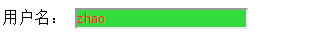
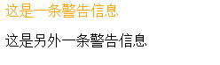

**web**
==
一/css
* 使用css
  * 外链

    `<link rel="stylesheet" href="css/css.css">`
  * 嵌入
    ```
    <style type="test/cdd">
      li{margin:0;list-style:none;}
      p{margin:1em 0;}
    </style>
    ```
  * 内联 （不要使用）

    `<p style="margin:1em 0">EXAMPLE CONTENT</p>`
* 注释
* 选择器（用来从页面中选择元素，以给它们定义样式）

> 以下四种为简单选择器

  * 通配选择器
  ```
        /* 匹配所有元素 */
      * {
        box-sizing: inherit;
      }
  ```
  * 标签选择器
  ```
        /* 匹配所有p元素 */
      p {
        margin: 1em 0;
      }
  ```
  * id选择器  `#EXAMPLE`
  ```
      <p id="example">Example Content</p>

    <style type="text/css">
      /* 匹配id为example的元素
       * 注意：id 值在一个 HTML 中必须唯一
       */
      #example {
        font-size: 14px;
        line-height: 1.6;
        color: red;
      }
    </style>
  ```
  * 类选择器

    ```
          <p class="warning">这是一条警告信息</p>
      <!-- 可以给一个元素指定多个class，用空格隔开 -->
          <p class="warning icon">这是另外一条警告信息</p>

          <style type="text/css">
            .warning {
            color: orange;
          }
            .icon {
              background: url(warn.png) no-repeat 0 0;
          }
          </style>
    ```

     有两个class
     适用于一组相同类型的属性定义

>

  * 属性选择器
    ```
    <p>
      <label>用户名：</label>
      <input name="username" value="zhao" disabled>
    </p>

    <style>
      input[disabled] {
        background: #eee;
        color: #999;
        cursor: not-allowed;
      }
    </style>
      }
    ```
    * disabled是屏蔽输入

    

    * [class^="icon-"]以icon开头
      [class*=" icon-"]接在别人后面
          [class^="icon-"],[class*=" icon-"]

    * 伪类

    （基于DOM之外的信息去（比如根据用户和网页的交互状态）选择元素

      ```
      a:link     /*未访问过的链接*/
      a:visited   /*已访问过的链接*/
      a:hover{}   /*鼠标移到链接上的样式*/
      a:active    /*鼠标在链接上按下时的样式*/
      a:focus    /*获得焦点时的样式*/  比如按下回车
      ```

      ```
      <nav>
        <ul>
          <li><a href="http://w3.org">W3C</a>
          <li><a href="http://example.com">example.com</a>
          <li><a href="http://www.360.com">360</a>
        </ul>
      </nav>

      <label>搜索：<input name="q" type="search"></label>

      <style>
        a:link {
          color: black;
        }
        a:visited {
          color: gray;
        }
        a:hover {
          color: orange;
        }
        a:active {
          color: red;
        }
        :focus {
          outline: 2px solid red;
        }
      </style>

      ```
    * 选择器组合

      * 直接组合EF
      ```
      <p class="warning">这是一条警告信息</p>
      <div class="warning icon">这是另外一条警告信息</div>
      p.warning { color: orange; }
      ```
      


        组合形式：
        `E[foo="bar"]`
        `E.warning`
        `E#myid`
        `#myid.warning`
        `.warning[foo="bar"]`

      * 后代组合E F
      * 亲子组合E>F  `article>p`要直接属于article才会被选中

    * 同时给一组选择器定义样式

  * CSS求值过程
    *
